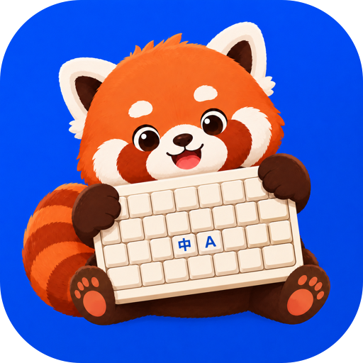

<div align="center">



# LockIME

[English](../../README.md) · [简体中文](README.zh-CN.md) · [繁體中文](README.zh-TW.md) · [日本語](README.ja.md) · [Français](README.fr.md) · [Deutsch](README.de.md) · [Español](README.es.md) · [Português](README.pt.md) · **Русский**

[](https://github.com/oomol-lab/LockIME/releases/latest)
[](https://github.com/oomol-lab/LockIME/actions/workflows/ci.yml)
[](../../LICENSE)
[](https://www.apple.com/macos/)
[](https://swift.org)

</div>

Приложение для строки меню macOS, которое **блокирует источник ввода клавиатуры**. Как только вы (или другое приложение) переключаете метод ввода, LockIME немедленно возвращает заблокированный — глобально, для каждого активного приложения или (в дополнительном расширенном режиме) для каждого URL в браузере.

> macOS 14+ · Apple silicon и Intel — отдельные приложения, скачайте файл
> `-arm64` или `-x86_64`, подходящий вашему Mac · создано на SwiftUI,
> Liquid Glass на macOS 26 (Tahoe).

## Screenshots

<p align="center">
  <picture>
    <source media="(prefers-color-scheme: dark)" srcset="../images/settings-general-en-dark.png">
    
  </picture>
  <picture>
    <source media="(prefers-color-scheme: dark)" srcset="../images/settings-app-rules-en-dark.png">
    
  </picture>
  <picture>
    <source media="(prefers-color-scheme: dark)" srcset="../images/settings-url-rules-en-dark.png">
    
  </picture>
</p>

## Install

Установите через [Homebrew](https://brew.sh) (cask сам выберет сборку, соответствующую архитектуре вашего Mac):

```sh
brew install --cask oomol-lab/tap/lockime
```

Или скачайте `.dmg`, подходящий вашему Mac (`-arm64` для Apple silicon, `-x86_64` для Intel), со страницы [последнего выпуска](https://github.com/oomol-lab/LockIME/releases/latest). В обоих случаях приложение автоматически обновляется через Sparkle.

## Features

- **Мгновенная повторная блокировка** — возвращает активный источник ввода к заблокированному в тот же момент, когда вы (или другое приложение) его меняете, — глобально или для каждого приложения.
- **Управление из строки меню** — включение/выключение, смена заблокированного источника ввода, просмотр текущего источника и счётчик срабатываний прямо в строке меню.
- **Сочетания клавиш** — настраиваемые глобальные сочетания для включения/выключения блокировки и перебора заблокированного источника ввода, а также сочетания для отдельных приложений, позволяющие переключать или удалять правило активного приложения.
- **Запуск при входе в систему** — стартует автоматически при входе (по умолчанию выключено).
- **Светлая и тёмная темы** — единый, нативный для системы язык дизайна, адаптирующийся к светлому и тёмному оформлению, плюс фирменная иконка приложения. См. [docs/DESIGN.md](../DESIGN.md).
- **Смена языка на лету** — мгновенно переключайтесь между 9 языками без перезапуска: English, 简体中文, 繁體中文, 日本語, Français, Deutsch, Español, Português, Русский.
- **Журнал срабатываний за 24 часа** — смотрите, что было переключено, почему и как долго.
- **Автообновление** — каналы stable и beta через Sparkle, с собственным окном обновления.
- **Базовая блокировка не требует системных разрешений** — дополнительный расширенный режим, защищённый разрешением Accessibility, открывает более тонкие правила для URL и поля с фокусом.

## Design

LockIME следует единой системе дизайна (`Sources/LockIME/UI/DesignSystem.swift`): семантические цвета, системные материалы и SF Symbols обеспечивают адаптацию к светлой/тёмной теме; Liquid Glass зарезервирован только за плавающим/навигационным слоем. Фирменный акцентный цвет «Lock Indigo» поставляется как ассет `AccentColor`. Полная спецификация — в [docs/DESIGN.md](../DESIGN.md).

Иконка приложения генерируется программно (без дизайнерских инструментов) — пересоздайте её командой:

```sh
./scripts/make-appicon.sh   # renders the master via SwiftUI and rebuilds the appiconset
```

## Development

Требуются Xcode 26+ (само приложение нацелено на macOS 14+), а также [XcodeGen](https://github.com/yonaskolb/XcodeGen) + [xcbeautify](https://github.com/cpisciotta/xcbeautify) (`brew install xcodegen xcbeautify`).

```sh
make gen     # generate LockIME.xcodeproj from project.yml
make build   # build (Debug)
make run     # build & launch
make test    # run unit tests
make archive # Release archive (Developer ID)
```

Проект Xcode генерируется из `project.yml` и не хранится в репозитории.

Интеграционные тесты, затрагивающие железо (реальное переключение TIS), исключены из `make test`; запускайте их через `make test-hw` (кратковременно меняет источник ввода).

## Releasing

Нотаризованные релизы с Developer ID, запускаемые через dispatch, с автообновлением Sparkle по каналам **stable** и **beta**: запустите workflow Release (Actions → Release) — он вычислит версию по git-тегам, соберёт приложение и автоматически создаст тег и GitHub Release — никогда не пушьте тег вручную. Канал beta — это ночная сборка. Каждый релиз содержит отдельные приложения для Apple silicon и Intel, каждое со своим фидом обновлений (без universal-бинарника и без обновлений между архитектурами). См. [docs/RELEASING.md](../RELEASING.md).

## Architecture

- **LockIMEKit** (статическая библиотека) — чистая, полностью покрытая модульными тестами логика, использующая только системные фреймворки: движок блокировки, монитор приложений, правила, расширенный (Accessibility) наблюдатель, модель журнала, локализация.
- **LockIME** (приложение) — `@main`, интерфейс на SwiftUI, система дизайна и тонкие интеграционные прослойки для Sparkle, KeyboardShortcuts, PermissionFlow и MarkdownUI.

## License

Copyright © 2026 Hangzhou Wumou Software Co., Ltd.
